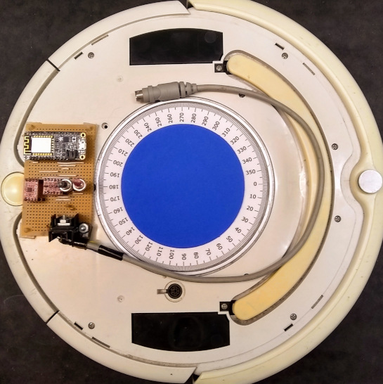
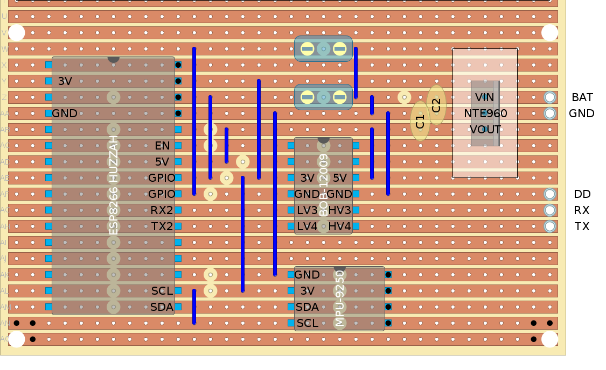
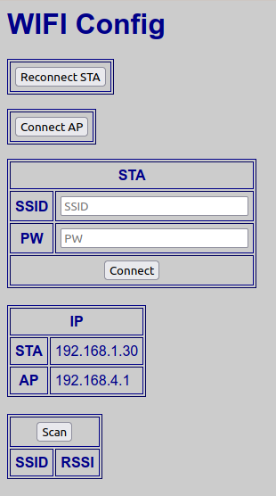
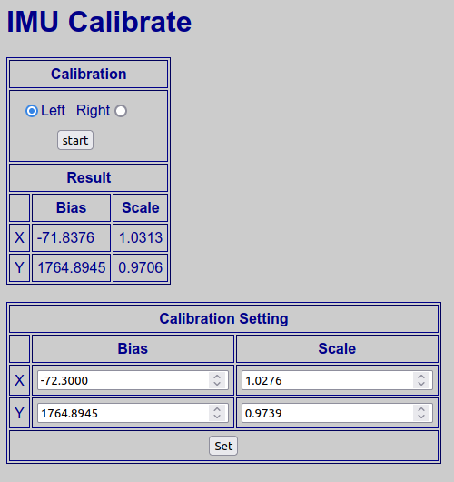
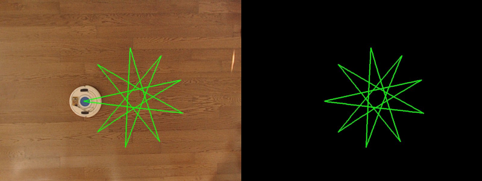

# Roomba
Roomba 530 navigation using ESP8266 and MPU-9250.  Motion tracking with Python.

#### Build

The Roomba 530 uses the _[iRobot Roomba 500 Open Interface Specification (ROI)](https://www.irobot.lv/uploaded_files/File/iRobot_Roomba_500_Open_Interface_Spec.pdf)_. 
The Arduino library that supports that is available here: http://www.airspayce.com/mikem/arduino/Roomba/

This program is using 19200 baud for communication to the Roomba.  To set the baud rate:
*When powering on Roomba, hold down the Clean/Power button. After about 10 seconds, Roomba plays a tune of descending pitches.*

Circuit board (top view):

#### Configure WiFi

The ESP8266 will automatically connect to the last used access point based on configuration saved in flash memory.  
If this is the first time connecting (or the access point is unavailable), this program will create a _soft access point_ with SSID: __roomba10__ and Password: __carbondioxide__.
Connect with a WiFi client and browse to __http://roomba10.local__ to access the program.

To configure the ESP8266 to use an existing access point, browse to __http://roomba10.local/config__, and enter the SSID and PW.  The STA IP is the assigned address on the network:

The ESP8266 will automatically connect to that network on reboot.

#### Calibration (Compensation)

The MPU-9250 is sitting close to the Rooma, in a distorted magnetic field.  To compensate, access __http://romba10.local/calibrate__:

Select direction for Roomba rotation and press start.  When the Roomba stops rotating refresh the page to view the results.  The Bias values seem to vary quite a bit, so you may need to manually adjust for best results.  Enter values and press Set.

#### Track

To track the position of the Roomba, place a contrasting color on the Roomba - something not visible anywhere else in the camera view - and use *scripts/track.py* (requires Pygame: https://www.pygame.org/wiki/GettingStarted).  Click to select the color; a line will be drawn connecting the centroid of the color as the Roomba moves.  Press "w" to save the image.  Two image files are created:

#### Patterns

Patterns are defined in *steps.h*.  Eact step of the pattern is a 6-digit number:  2 digits of command and 4 digits of data:

	int stepCommand = Pattern[stepMode].Steps[rStep]/10000;	
	int stepData    = Pattern[stepMode].Steps[rStep]%10000;

The basic commands are:

      case 0:   rStep = stepData; roombaStatus = 0; break;
      case 20:  driveDistance(stepData); break;
      case 21:  driveDistance(-stepData); break;
      case 22:  driveVelocity(stepData); break;
      case 30:  turnAngle(stepData); break;
      case 39:  turnNoStop(stepData); break; // turn without stopping
      case 40:  arcAngle(stepData); break;
      case 50:  setArcRadius(stepData); break;
      case 51:  decArcRadius(stepData); break;
      case 52:  incArcRadius(stepData); break;
      case 99:  stopMotion(); break;

#### Bugs

There's a 0/180 problem:  when the Roomba is pointing 180 degrees and the command is rotate to 0... it doesn't.
